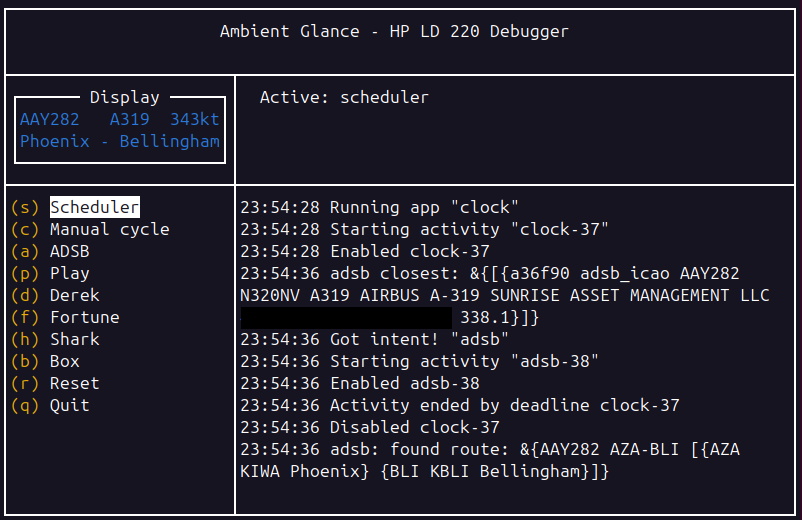
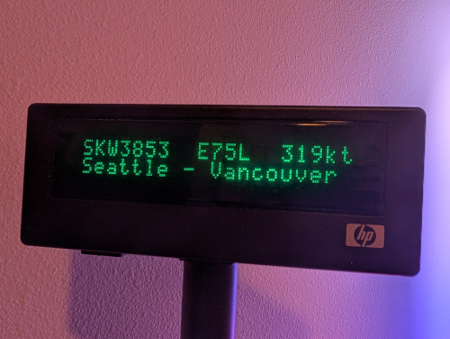

# Ambient Glance

Ambient Glance is program powering an ambient information display based on a
LD220-HP POS pole display (normally used in the context of a retail Point Of
Sale).  Ambient Glance features a driver for the display, a TUI mirror used for
development/debugging, individual "apps" that can be shown, and a scheduler
supporting both an automatic carousel between apps and preemption.

The following apps are implemented today:
* Clock
* Fortune - based on the fortune(6) command
* 8 clap - The UCLA 8 clap
* ADS-B - to display the closest detected aircraft within a small radius of a
  receiver
* [OneBusAway](https://onebusaway.org/) - Transit arrival data

> This is not an officially supported Google product. This project is not
> eligible for the [Google Open Source Software Vulnerability Rewards
> Program](https://bughunters.google.com/open-source-security).






## Sample config

```json
{
  "adsb": {
    "tar1090_endpoint":"http://localhost:30152",
    "lat":"",
    "lon":"",
    "radius":"3"
  },
  "oba": {
    "key": "api key goes here",
    "stops": ["stop code"],
    "route_alias": {
      "route code": "NAME"
    }
  }
}
```
